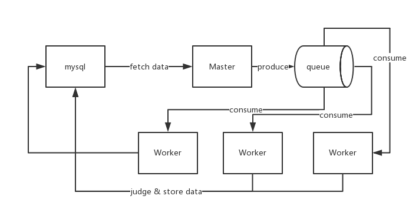

# SABO 


## [Sabo](http://onepiece.wikia.com/wiki/Sabo)

> Sabo is the Revolutionary Army's Chief of Staff, recognized as the "No. 2" of
> the entire organization, ranking directly under Monkey D. Dragon himself.[2]
> Next to being the sworn brother of Monkey D. Luffy and Portgas D. Ace, he is of
> noble descent, the son of Outlook III, as well as via his parents the adopted
> brother of Stelly, the current king of the Goa Kingdom, whom Sabo has never
> recognized as such.

## 介绍

### `Proect Sabo` 的基本架构图


`Project Sabo` 是一款基于 Python3 和 C 编写的 ACMICPC 在线评测系统，功能简易，目前支持语言仅限于 `C/C++` 和 `JAVA`，支持 Special Judge 模式。

`Project Sabo` 目前采用的方案是通过轮询数据库得到评测数据，因此它高度依赖于数据库表设计，目前采用的数据库表是 [HUSTOJ](https://github.com/svn2github/hustoj) 的 `jol.sql` 文件，采用的数据库是 Mysql；之后的版本会考虑使用 `HTTP` 协议来传输评测题目元数据。

`Project Sabo` 能够拦截恶意的代码，避免对系统造成影响，这主要依赖于 `ptrace` 这个系统调用，同时支持简单的字符串过滤方式（可配），尽管这种方式十分鸡肋且不可靠。

`Project Sabo` 是可并发的，然而由于设计的限制，单个进程只监控一个用户进程，因此这注定了无法达到高并发。然而大多数情况下可以满足使用要求。

评测核心已经于 2016 年 6 月开始运行了几个月，比较稳定，目前该项目支持在 linux 的各个发行版本上运行。

## 快速开始

运行前确保你的操作系统上已经安装了 python3 和对应的 pip

```bash
git clone https://github.com/tokers/sabo sabo
cd sabo/
./install.sh

python3 sabo.py /path/to/sabo.conf
```

## sabo.conf
`Project Sabo` 支持用户配置，使用 yaml 配置文件，你可以在 conf/ 目录下找到配置文件的样板，包括是否以守护进程方式运行、JAVA 路径等等。

```
base:
    daemon: true # 是否以守护进程方式运行
    java_path: /usr/local/jdk/bin/java # JAVA 二进制路径
    java_bonus_time: 1000 # JAVA 额外奖励时间
    java_bonus_mem: 65536 # JAVA 额外奖励内存
    cocurrent: 1 # 并发数
    maxtime: 60000 # MS 用户进程时间限制最大值
    maxmem: 65536 # KB 用户进程内存限制最大值
    mintime: 1000 # MS 用户进程时间限制最小值
    minmem: 65536 # KB 用户进程内存限制最小值
    log_path: /home/vagrant/WorkStation/alex/ # 日志路径
    work_path: /tmp/sabo/ # 监控进程工作目录
    data_path: /home/vagrant/Project/NOJ/data/ # 数据目录
    str_filter: false # 是否开启字符串过滤
    filter_key_words: # 敏感词列表
        - pause
        - shutdown
        - restart


# database
db:
    db_interval: 3 # 数据库轮询间隔
    db_retry: 3 # 数据库操作失败尝试次数
    db_type: mysql # 暂时只支持 mysql
    db_addr: 192.168.30.101 # 数据库地址
    db_port: 3306 # 端口
    db_user: root # 使用用户
    db_name: jol # 数据库名
    db_passwd: xxxxxx # 密码
```

## 使用注意事项
- 写入数据库状态码映射关系在 `config.py` 中写名，另外 `Runtime Error` 暂不区分堆栈溢出或者是浮点数异常或者是其他的段错误问题
- 确保 `Project Sabo` 拥有日志目录、工作目录的写权限和数据目录的读权限
- 并发值不建议太大，一般可以设置为 cpu 核心数目
- 建议使用时开启 `daemon`
